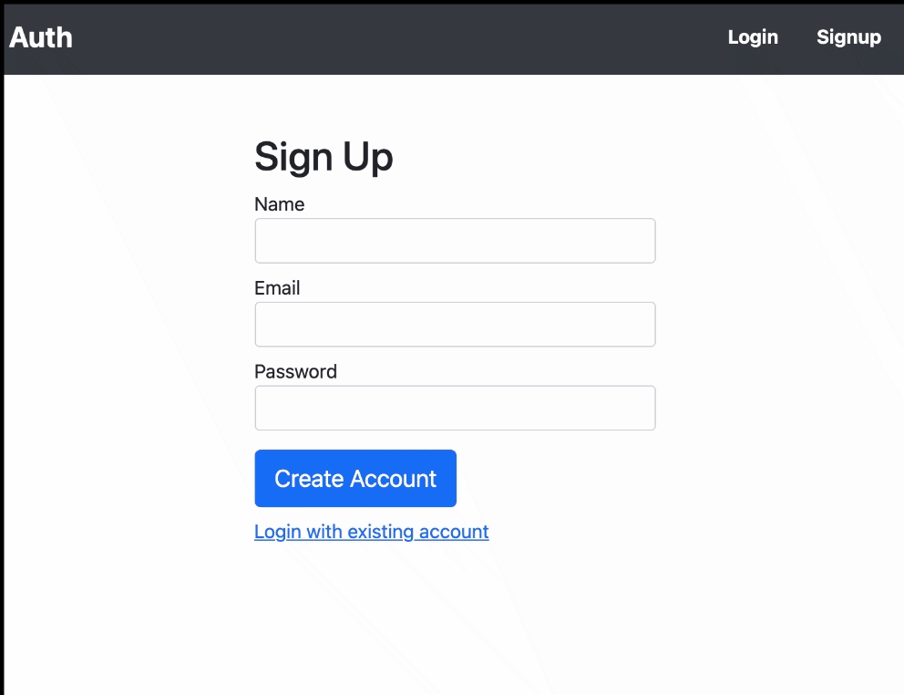
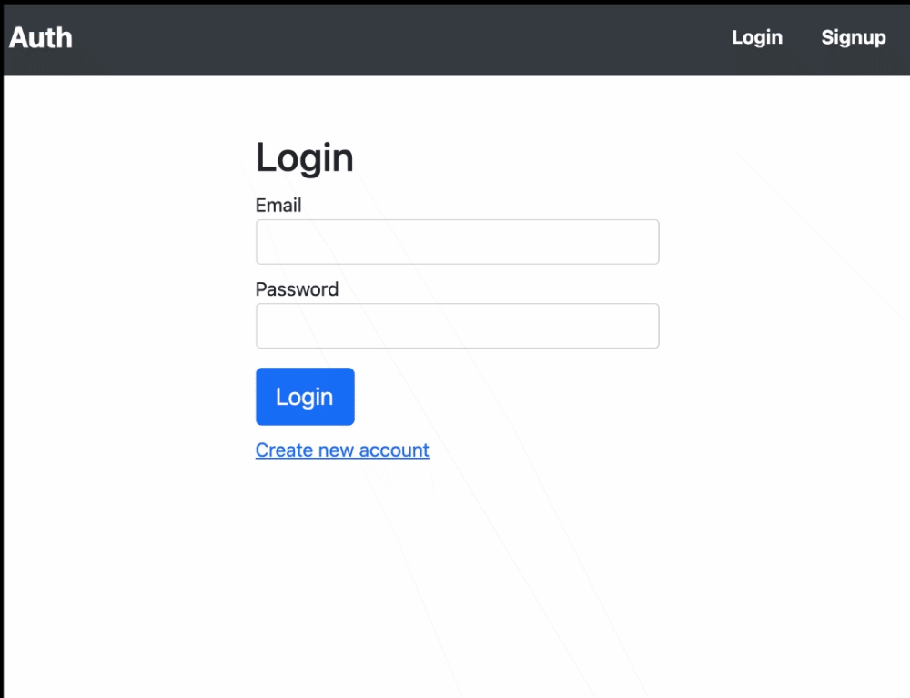
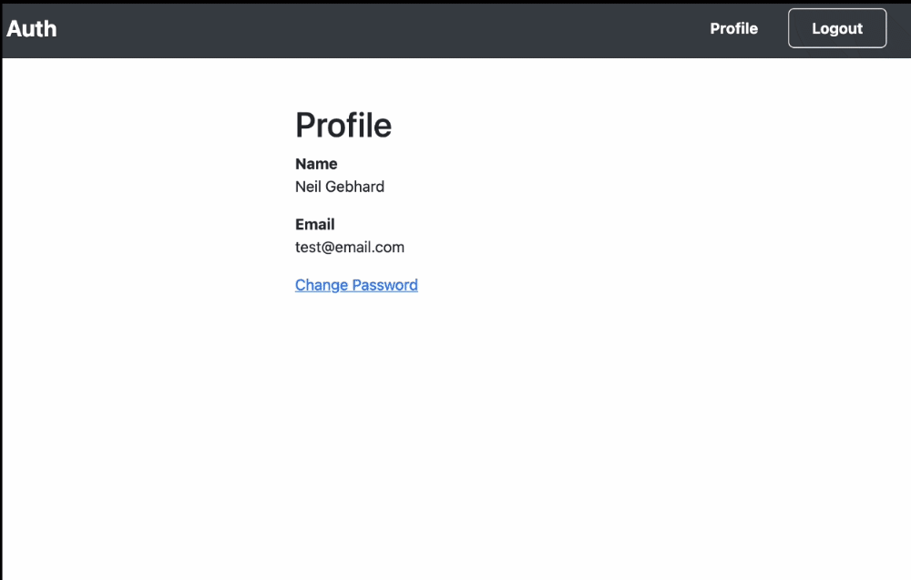

# Getting Started with Create React App

This project was bootstrapped with [Create React App](https://github.com/facebook/create-react-app). It uses [Firebase Authentication](https://firebase.google.com/products/auth) for logging in and signing up and [Reactstrap](https://reactstrap.github.io/) for styling. The app is deployed on [Netlify](https://neilsauthapp.netlify.app/).

The features of this app are:

- Signup

- Login

- Change password

Some features I would add in the future are:

- Form validation
- Testing
- Better error handling and user feedback

😊