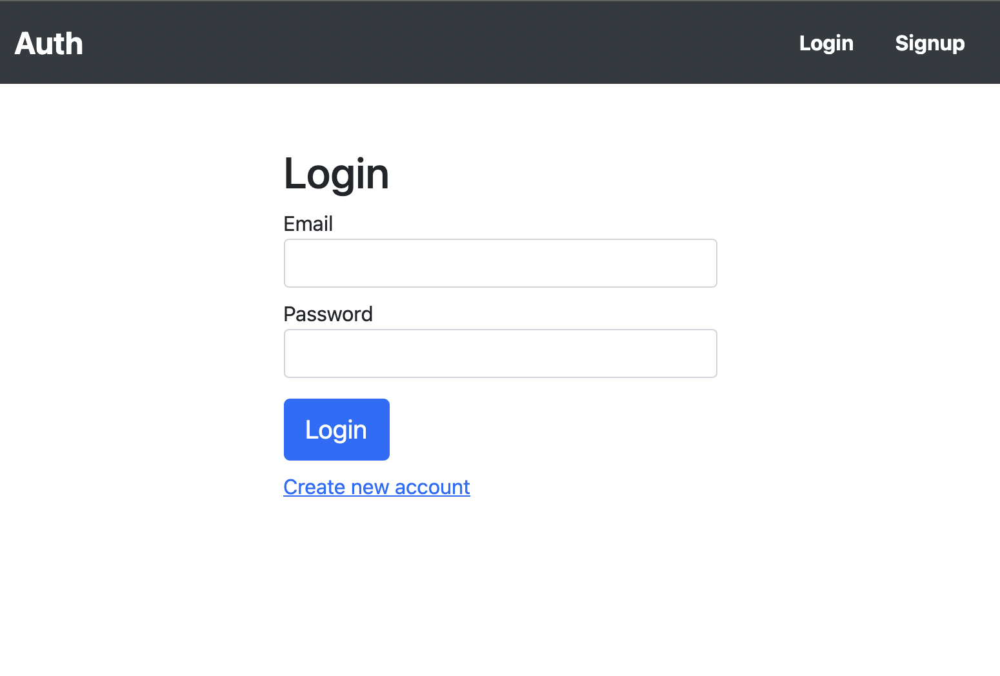

[](https://app.netlify.com/sites/neilsauthapp/deploys)

## Auth web app

- [General info](#general-info)
- [Technologies](#technologies)
- [Setup](#setup)

## General info

This repository holds the source code for a simple authentication web app It has login, signup, and change password capabilities. Authentication persists with localStorage.

## Technologies

Project is created with:

- [Firebase Authentication](https://firebase.google.com/products/auth)
- React: 17.0.2
- React Router: 5.3.0
- Reactstrap: 8.10.0
- localStorage

## Setup

To run this project, you'll need to create a .env file at the root of the project and set the variable REACT_APP_AUTH_API_KEY to your Firebase Authenticatino api key. Install it locally using npm:

```
$ cd ./auth-react
$ npm install
$ npm start
```

## Demo

The live demo is deployed on Netlify: https://neilsauthapp.netlify.com/


